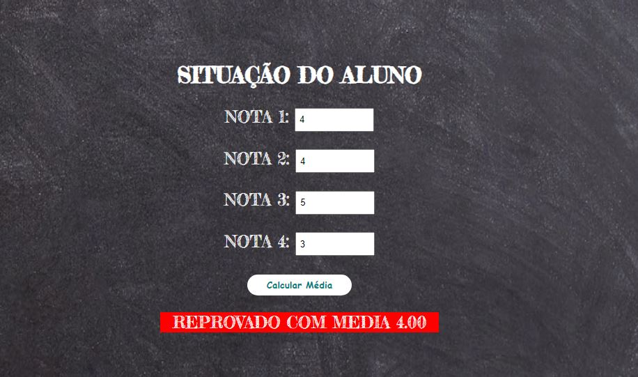

 <h1><a href:'https://eduardohbarbosa.github.io/SituacaoAluno/'>Situação do Aluno</a></h1>
 
Programa para calcular a média de um aluno e mostrar se ele foi aprovado ou está de recuperação ou se foi reprovado.

 
 <h2>Situação Aprovado</h2>
 
 
 
 <h2>Situação Reprovado</h2>
 
 
 
 <h2>Situação Recuperção</h2>
 
 
 

